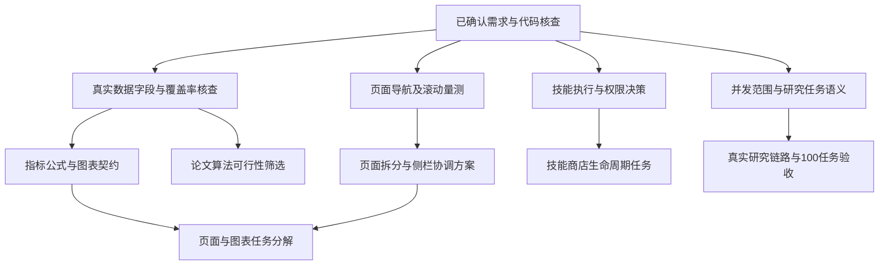
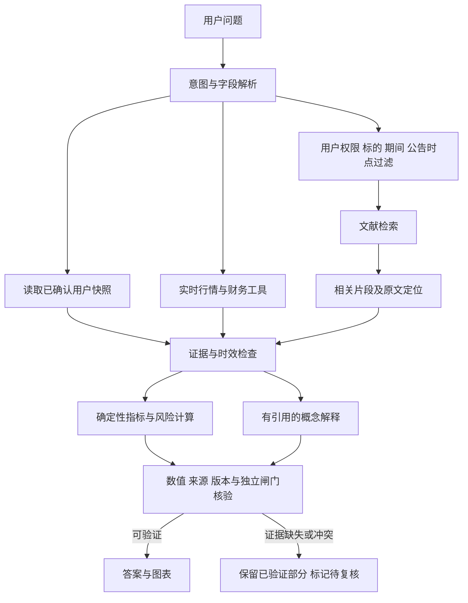

# Prism 研究平台研发任务技术文档

本文供研发团队分解任务与制定验收标准，覆盖页面与侧边栏、A 股指标图表、同花顺指标技能商店、研究任务并发、论文算法及降低模型幻觉的存储与检索方案。当前已确认需求与代码基线；设计问题尚在澄清，本文不表示任何新增功能已实现或性能已达标。

## 第1章 需求范围与实施约束

### 一、 已确认需求

| 编号 | 需求事项 | 已确认内容 | 尚待明确 | 研发影响 |
| --- | --- | --- | --- | --- |
| R01 | 文档用途 | 仅用于研发任务分解 | 无 | 按任务、依赖、产物与验收组织 |
| R02 | 并发对象 | 至少 100 个研究 Agent 任务同时执行 | 全局或单请求；是否逐任务包含模型分析 | 排队、HTTP 请求与模型调用分别计数 |
| R03 | 市场范围 | A 股 | 整个市场模块或仅行业／概念板块 | 决定标的集合与聚合口径 |
| R04 | 实施优先级 | 页面与图表展示优先 | 核心图表与页面拆分规则 | 先定义界面和真实数据展示契约 |
| R05 | 数据条件 | 根据现有可获得数据实现，未知内容查公开资料 | 数据覆盖、历史长度、供应商配额 | 以字段可得性决定算法范围 |
| R06 | 技能商店 | 真实管理同花顺指标 Skill | 执行方式、管理权限与个人能力组合 | 需要目录与实际调用能力一致 |
| R07 | 内容参考 | 土豆看财报的内容思路及 Codex 商店截图 | 作者指标原始计算定义尚未取得 | 参考主题与本项目公式分别记录 |
| R08 | 降低模型幻觉 | 用户要求评估本地数据库、RAG 等提升空间 | 知识库范围与检索方案尚未选型 | 补充可信事实、时效、检索与输出核验任务 |

目前未取得明确的实施期限、团队人数和服务器配置。文档不虚构日程、人力或性能容量。

### 二、 不变约束

1. LLM 仅承担意图识别、槽位解析与自然语言说明；金额、比例、敞口、指标与调仓由确定性程序计算。
2. 新增指标和技能调用继续经过来源、时点、单位与质量检查，不能绕过独立风险及合规闸门。
3. 图表需同时保留统计口径、数据来源、更新时间及缺失状态；数据缺失不能显示为零或正常。
4. 研究任务及并发度的领域定义见 [GLOSSARY.md](../../GLOSSARY.md)。实际执行计数不得以排队量、累计执行量或 HTTP 请求数替代。

## 第2章 当前实现与证据边界

### 一、 代码基线

| 范围 | 已验证实现 | 关键依据 | 尚未证明 | 对应工作 |
| --- | --- | --- | --- | --- |
| 研究调度 | DAG 活动节点使用异步并行及调用预算 | `app/orchestration/executor.py`、`app/providers/runtime.py` | 服务全局 100 任务能力 | 真实运行链路与负载验收 |
| 真实研究矩阵 | 默认矩阵服务使用 Fixture，LIVE 拒绝执行该矩阵 | `app/api/main.py`、`app/service/specialist_matrix.py` | 矩阵已接入真实数据提供方 | 真实 Provider 与矩阵接入 |
| 工作流规模 | 可编辑工作流最多 32 节点；现有矩阵模板为 8 节点 | `app/service/workflow.py`、`app/service/specialist_matrix.py` | 单 DAG 100 节点 | 根据并发范围决定是否改契约 |
| 执行状态 | 根节点先登记 RUNNING，整批完成后落结果 | `app/orchestration/state_machine.py`、`app/orchestration/executor.py` | RUNNING 数量等于真实活动数量 | 在真实执行进入与退出处统计 |
| 同花顺能力 | 项目清单包含固定 9 项 API 能力；加载器限定数量 | `app/providers/iwencai_skills.json`、`app/providers/skillhub.py` | 动态安装、更新与卸载 | 版本化能力注册与生命周期 |
| 下载包边界 | 当前通过 API 适配器调用，未直接执行下载包脚本 | `docs/iwencai-live-provider.md` | 九项元数据等于九个可执行包 | 明确安装及执行语义 |
| 导航 | 五个普通入口及开发者治理入口，采用 hash 切换面板 | `app/api/static/index.html`、`app/api/static/app.js` | 某页确实过长或存在滚动冲突 | 浏览器量测后制定拆分规则 |
| 既有算法 | HHI、基金穿透、约束权重重分配及独立闸门 | `app/risk/concentration.py`、`app/portfolio/exposure.py`、`app/service/portfolio_optimization.py` | 均值方差、CVaR 或风险平价求解器已实现 | 新算法与既有规则明确区分 |

以上结论来自代码及历史资料核查。本轮未执行新的压测或真实行情调用，文件长度不能作为用户界面过长的证据。

### 二、 历史性能证据

2026 年 9 月 18 日的测试在单个登录账户下，对问卷读取接口发起 100 并发任务及 1,000 次真实 TCP HTTP 请求，全部成功，P95 为 6.019 秒。测试不包含模型或金融查询，不能证明 100 个研究任务同时执行，也不能证明完整投顾响应符合原文档中的 3 秒要求。

依据：[系统测试报告](../submission/system-test-report.md)、[HTTP 原始结果](../submission/test-evidence/http-results.json)。原有 100 用户并发要求与本次 100 研究任务需求应分别维护，不能互相替代。

## 第3章 界面与技能商店设计基线

### 一、 截图可提取的交互要求

| 界面区域 | 参考特征 | 本项目待设计内容 | 数据关联 | 验证方式 |
| --- | --- | --- | --- | --- |
| 左侧区域 | 能力分类与已安装列表 | 同花顺技能分组及安装状态 | 能力注册记录 | 导航与状态一致性 |
| 顶部工具栏 | 搜索、刷新、设置与添加 | 搜索和导入管理入口 | 目录与生命周期接口 | 空结果、失败及权限路径 |
| 主区目录 | 公开／个人切换与分组条目 | 公共能力与个人选择范围 | 权限与个人能力配置 | 账户隔离 |
| 能力条目 | 图标、名称、说明与添加／更多操作 | 详情、安装和管理入口 | 包版本及可调用状态 | 界面操作确实改变能力 |

公开／个人目录的权限、安装单位与执行方式尚未确认。本章仅提取截图中的交互结构。

### 二、 历史页面布局证据

未取得可用的本地 Prism 浏览器会话，本轮没有实时页面量测。以下为 2026 年 9 月 17 日保存的全页截图，宽度均为 1440 像素；高度反映当时内容长度，不等于当前页面状态，也不证明 1024×768 下的响应式效果。

| 页面 | 快照高度 | 可观察的内容组织 | 拆分候选 | 证据 |
| --- | --- | --- | --- | --- |
| 个人中心 | 4115 像素 | 画像摘要、八维图、资产参考、19 题问卷及偏好设置纵向排列 | 画像结果、问卷填写、偏好设置 | [个人中心快照](../showcase/current-pages-snapshot-profile-20260917.png) |
| 持仓分析 | 3432 像素 | 报告、风险对照与多处行业预算及集中度展示 | 持仓管理、组合报告；合并重复风险展示 | [持仓快照](../showcase/current-pages-snapshot-portfolio-20260917.png) |
| 大盘鉴别 | 2016 像素 | 行情、宏观与行业观察纵向排列 | 行情、情绪与活跃度、板块与风格 | [大盘快照](../showcase/current-pages-snapshot-market-20260917.png) |
| 交易风格 | 1405 像素 | 历史交易与风格分析 | 优先整理信息层级 | [交易风格快照](../showcase/current-pages-snapshot-trading-style-20260917.png) |
| AI 对话 | 1165 像素 | 对话与任务工作台 | 保留对话入口，详细报告跳转对应页面 | [工作台快照](../showcase/current-pages-snapshot-workbench-20260917.png) |

快照启用了开发者模式，个人中心底部兼容表单不代表普通用户页面的全部必需内容；交易风格截图为空状态，不能据此推断有交易记录时的页面长度。

当前侧栏采用固定视口高度及 `overflow:hidden`，新增技能商店入口后需检查导航项是否被裁切；对话区存在独立滚动容器，需联合验证页面滚动和内部滚动。1024 像素宽度会触发布局降列，但实际溢出及操作可达性仍待验证。依据：`app/api/static/prism-v2.css`、`app/api/static/pages-snapshot.js`。

表中拆分方向为候选方案。最终布局需结合真实内容、不同视口、滚动位置恢复及侧栏选中态验证后确定。

### 三、 页面与指标的依赖关系

## 第4章 指标参考与算法候选

### 一、 现有数据的可行性

| 数据类型 | 已有路径 | 当前限制 | 可支持的首期展示 | 数据补齐要求 |
| --- | --- | --- | --- | --- |
| 指数日线 | 四项 A 股指数 OHLC；成交量及成交额可选 | 非完整风格指数集合，量额可能缺失 | 收益、动量、实现波动、回撤与状态概率 | 日期对齐、历史长度与量额单位 |
| 股票快照 | 单股与批量价格、涨跌幅、量额及时间 | 没有现成换手率、涨跌停状态契约 | 指定观察集的价量分布 | 固定观察集、覆盖率及字段探测 |
| 全市场目录 | 部分交易所查询及候选证券搜索 | 没有统一全市场枚举与历史成分 | 仅展示已知观察集 | 沪深北目录、历史成分与退市样本 |
| 行业数据 | 行业归属及 12 项行业指数观察集 | 目录截取不是全行业排行；无概念多对多关系 | 明示观察集的行业强弱热力图 | 完整行业目录、历史日线与概念归属 |
| 新闻文本 | 公告、新闻、研报标题与摘要 | 每类最多 5 条；无社区关注与散户账户数据 | 新闻线索及文本标签 | 去重、分页、历史覆盖与抽样偏差 |
| 资金与参与者 | 未证实逐笔、大小单及参与者身份路径 | 不能识别真实散户参与度或主力流向 | 不作为当前直接观测指标 | 明确字段、产品权限与真实响应 |

上述“已有路径”仅表示代码存在契约与调用过程，本轮未调用接口验证当前账户权限或覆盖完整性。普通价量数据可形成市场行为与活跃度代理，不能直接命名为真实散户人数或主力资金流。

`app/providers/skillhub.py` 中 `sentiment` 缺失时默认 `NEUTRAL`，`confidence` 缺失时默认 `1.0`；这些默认值不能作为有效情绪观测或置信度参与聚合。情绪图表任务需要显式区分缺失与真实中性。

公开产品资料可用于寻找补齐路径，但不能替代项目权限验证。例如 [同花顺 SuperMind 文档](https://quant.10jqka.com.cn/view/help/4?from=ifind)的历史行情能力不等于当前 SkillHub 已接入；[iFinD 官方 FAQ](https://quantapi.10jqka.com.cn/gwstatic/static/ds_web/quantapi-web/help-center/faq.html)所述数据产品和逐笔能力也需单独核查账号权限。

### 二、 作者内容核查

搜索公开页面已找到署名“土豆看财报”的韭菜指数系列，与用户提供的账号关联。当前依据为公开标题、简介、标签与合集文字，未取得完整字幕或计算公式。不得将本项目自行定义的指标归因于该作者。

| 参考内容 | 可核实主题 | 对研发的启发 | 未取得内容 | 原始入口 |
| --- | --- | --- | --- | --- |
| 9.7 韭菜指数 | 韭菜指数系列 | 研究情绪图表的表达 | 指标公式及训练数据 | [B站视频](https://www.bilibili.com/video/BV1o6bN6HEnS/) |
| 9.18 韭菜指数 | 踏空情绪与红利／科技切换 | 区分情绪与风格变化 | 样本、权重与阈值 | [B站视频](https://www.bilibili.com/video/BV1vcem62EtB/) |
| 9月第三周韭菜指数 | 半导体及光模块热度 | 板块热度与分布展示 | 热度的原始观测方法 | [B站视频](https://www.bilibili.com/video/BV1nGeq6bE6R/) |

散户身份与情绪不能直接从普通行情认定。后续需要区分真实参与者数据、关注度数据与价量代理指标，并采用与数据含义一致的名称。

### 三、 外国论文算法候选

| 候选 | 原始资料 | 数据要求 | 可视化方向 | 待验证事项 |
| --- | --- | --- | --- | --- |
| 市场状态切换 | Ang 与 Bekaert，2002，International Asset Allocation With Regime Shifts | 连续收益序列；本项目日频方案属于改编 | 状态概率、波动区间及状态变化 | 样本长度、拟合稳定性与样本外表现 |
| 五因子模型 | Fama 与 French，2015，A five-factor asset pricing model | 收益、市值、账面权益、利润相关字段、总资产及公告时点 | SMB、HML、RMW、CMA 风格曲线 | 财务时点完整性；不能等同科技／红利风格 |
| 协方差收缩 | Ledoit 与 Wolf，2004，Honey, I Shrunk the Sample Covariance Matrix | 对齐的多资产历史收益 | 稳健相关热力图与风险集中展示 | 常相关目标与其他实现差异；缺失值及正定性 |

原始资料：[Ang 与 Bekaert 作者论文](https://www0.gsb.columbia.edu/faculty/gbekaert/papers/international%20assel%20allocation.pdf)、[Fama 与 French 作者论文](https://faculty.chicagobooth.edu/-/media/faculty/eugene-fama/teaching/private/readings/afive-factorassetpricingmodel.pdf)、[Ledoit 与 Wolf 工作论文](https://bse.eu/sites/default/files/working_paper_pdfs/92.pdf)。

以上为候选，尚未选型。算法任务需给出确定性公式、数据时点约束、数值容差、基准比较和失败状态，不能仅以论文名称作为交付物。

## 第5章 事实存储与检索增强

### 一、 问题边界及现有实现

数据库提供持久化、版本及可追溯性；RAG 为回答提供检索材料。两者的有效性取决于入库来源、时点、权限与输出校验。已保存的错误结论、已过期的报价或错误召回的财报仍可能造成幻觉，不能以“已有数据库”或“接入向量库”作为真实性验收。

| 能力 | 已验证实现 | 关键依据 | 当前边界 | 提升方向 |
| --- | --- | --- | --- | --- |
| 本地数据库 | SQLite 已保存画像、持仓、会话、记忆及决策事件 | `app/store/sqlite.py`、`app/store/migrations` | 数据库存在不代表资料已形成完整可信检索库 | 扩展事实与文献的来源、版本及索引 |
| PostgreSQL | 可通过数据库配置切换，已有适配器 | `app/store/postgres.py`、`app/api/main.py` | 现有适配器仍单连接及串行写锁，不是连接池方案 | 先评测读写争用，再决定连接池与部署 |
| 历史记忆 | 显式保存结构化问卷、画像、持仓及内容哈希 | `app/store/context.py`、`app/service/semantic_memory.py` | 标记 HISTORICAL_ONLY，不能自动恢复为当前事实 | 保留历史与当前事实分离，按版本核对 |
| 语义检索 | 最近 100 条本用户记录的关键词匹配或模型重排 | `app/service/semantic_memory.py` | 不是 embedding 向量文献 RAG；聊天未自动调用它 | 单独建立文献检索链路与有限检索工具 |
| 会话事实 | 服务端锁定画像与持仓版本；流中检查漂移 | `app/service/session_truth.py`、`app/api/main.py` | 覆盖当前画像及持仓；非全类型外部市场事实登记 | 扩展市场数据、指标和规则版本快照 |
| 结构化断言 | 核对明确字段与部分 BUY 排除条件 | `app/service/session_truth.py` | 不读取自由文本，未自动核验每项输出声明 | 声明结构化、引用核验及输出门控 |
| 工具事实输出 | 工具执行后由确定性模板汇总结果 | `app/llm/agent.py` | 不等于所有概念回答或未来 RAG 输出均已校验 | 保留数值模板，检索说明也须附有效依据 |

### 二、 存储与检索的职责分离

| 数据类别 | 推荐承载 | 允许用途 | 时点及版本要求 | 禁止的替代关系 |
| --- | --- | --- | --- | --- |
| 当前确认画像与持仓 | 用户隔离的结构化数据库 | 个性化计算输入 | owner、revision、snapshot_id | 历史聊天不能覆盖当前确认值 |
| 行情与财务观察值 | 结构化事实及证据记录 | 查询、交叉验证和确定性计算 | 标的、字段、单位、期间、观察及抓取时间、来源 | 相似文段不能代替最新报价 |
| 公告、财报与研报 | 原始文档与可重建检索索引 | 按问题检索并解释 | 公告时间、版本、页码／段落及内容哈希 | 同源转载不能充当独立证据 |
| 指标说明与论文 | 版本化文献知识库 | 解释定义、输入条件与算法依据 | 作者、出处、方法版本与适用范围 | 论文结论不能替代本项目样本外验证 |
| 历史对话及模型输出 | 独立历史记录 | 理解指代、回看过程 | 用户、会话与生成时间 | 不能自动进入已验证事实库 |
| 衍生指标与报告 | 确定性计算结果及输入引用 | 图表、报告和输出数值 | 输入快照、算法版本及规则版本 | RAG 或 LLM 不负责重新算术 |

所有新字段需作为显式契约扩展，不能将其描述为现有 API 已提供。外部文档内容作为资料处理，不执行其中的指令；私有记录在检索和排序前按用户隔离。删除或更正原始资料后，关联索引和缓存也需失效。

### 三、 两条可行实施路径

| 路径 | 组成 | 优点 | 成本与限制 | 推荐条件 |
| --- | --- | --- | --- | --- |
| A 结构化事实与全文检索 | 复用现有数据库，补资料元数据、全文索引与输出核验 | 改动较少，标的、期间与精确字段容易核查 | 同义表达召回有限；中文检索需实测分词 | 首期先建立可信输入与核验基线 |
| B 事实库与混合 RAG | 在 A 上加入向量召回、关键词召回及有限重排 | 改善概念、规则和长文语义召回 | 增加 embedding、索引同步与召回评测成本 | 基线证明全文检索不足后扩展 |

推荐先采用 A 建立来源和数值核验，再以冻结问题集比较 B 是否增加有效召回。这样保留页面与图表优先顺序，同时避免先承担未经证明的检索复杂度。此为待确认建议，尚未决定数据库迁移或 RAG 实现。

SQLite 全文检索可评估 [FTS5 官方文档](https://www.sqlite.org/fts5.html)所述能力；若实际部署选用 PostgreSQL，向量能力可评估 [pgvector 官方项目](https://github.com/pgvector/pgvector)。本轮未安装扩展或验证当前运行环境支持，数据库迁移本身不保证消除写入争用。

### 四、 运行流程与输出核验

1. 行情、财务数值从结构化工具和事实记录获取；历史财报使用问题时点之前已公开的版本，防止未来信息进入历史判断。
2. 检索命中只表示资料相关，不表示其声明已验证。每项金融事实需能回到原始观察值或原文，引用地址存在不等于引用内容支持该声明。
3. 表格切片保留表头、单位、期间与原文位置；同公司不同报告期不得因语义相近而合并。
4. 每项输出声明关联 evidence_id、输入快照及方法版本；数值由后端按既有精度规则渲染，不交给模型重新计算。
5. 缺失、过期和冲突分别处理。可以保留已验证内容，但不得生成无依据的数字或将未解决的冲突改写成确定结论。
6. 会话版本漂移时停止当前个性化输出。现有逐 chunk 查询事实的实现与高并发有性能耦合，需评测后优化版本通知，不能以减少检查为由放松漂移拦截。

RAG 原始论文展示了检索对知识问答及事实性生成的改善，但不能据此保证金融答案正确。ALCE 将答案正确性与引用质量分别评价，适合借鉴其核验维度。[RAG 原始论文](https://arxiv.org/abs/2005.11401)、[ALCE 原始论文](https://arxiv.org/abs/2305.14627)。Self-RAG 可作为按需检索及支持性检查的研究参考，其论文方法包含专门训练，不能将普通提示词自检标为已经复现该算法。[Self-RAG 原始论文](https://arxiv.org/abs/2310.11511)。

### 五、 拟议研发任务及验收指标

下表为新增范围的建议任务，不表示已确认实施顺序。事实与数值核验可直接服务现有图表，文献检索增强可在数据基线稳定后安排。

| 任务 | 主要模块与边界 | 前置依赖 | 交付物 | 建议验收 |
| --- | --- | --- | --- | --- |
| AH01 来源与事实版本 | 扩展现有 Evidence 与快照契约 | 标的、期间及字段定义 | 原始观察值、版本及输入引用 | 抽样可复核；缺来源不升级为已验证 |
| AH02 文献入库与索引 | 公告、财报、研报、指标说明及论文 | 知识库来源范围 | 原文、片段、页码、公告时点及哈希 | 更正／删除后索引一致；同源转载去重 |
| AH03 检索路由与隔离 | 结构化查询和文献检索分别路由 | AH01、AH02 | 有限检索接口及关键词基线 | 跨用户泄漏为 0；历史问题不召回未来公告 |
| AH04 混合召回比较 | 向量与关键词组合及有限重排 | AH03 的冻结评测集 | 可重建索引与对照结果 | 证据召回达标且优于全文检索基线才扩展 |
| AH05 声明及引用核验 | 扩展结构化断言与输出管道 | AH01；文本路径依赖 AH03 | 声明与证据关联、数值模板及阻断原因 | 关键数值一致；无效引用不能输出已验证结论 |
| AH06 时效及版本门控 | 市场事实、画像、持仓与计算版本 | AH01、AH05 | 数据失效、冲突及漂移处理 | 过期值不冒充当前值；变更立即失效关联结果 |
| AH07 反幻觉评测 | 覆盖正常、缺失、过期、冲突、隔离与注入 | AH03、AH05、AH06 | 冻结问题集及逐声明人工依据 | 同时报告事实正确、引用支持、检索召回与延迟 |
| AH08 存储与检索负载 | 复用现有存储，按证据评估池化及索引 | 并发范围与数据量明确 | 数据库等待、检索时延及资源报告 | 100 研究任务下核验不被跳过；延迟预算另行确认 |

拟议发布门槛如下，需在完整设计确认时冻结。所有比例须同时报告样本量；分母为 0 时返回 N/A，不能计为通过。

| 指标 | 确定性统计定义 | 建议门槛 | 评测依据 | 限制 |
| --- | --- | --- | --- | --- |
| 关键数值一致率 | 满足对应字段精度及容差的关键数值数／全部关键数值数 | 100% | 已验证观察值与确定性结果 | 不能掩盖原始数据真实性问题 |
| 无依据事实率 | 人工判为缺乏支持的原子事实数／全部原子事实数 | ≤1% | 冻结问题集与原始依据 | 人工标注；不代表开放世界零幻觉 |
| 引用支持率 | 引用确实支持声明的声明数／全部带引用声明数 | ≥95% | 原文逐项核对 | 引用存在性不能代替支持性 |
| 证据召回 Recall@10 | 每题前 10 项召回的相关证据数／该题标注相关证据数，取题目平均 | ≥90% | 每题相关证据不超过 10 项的冻结集合 | 无相关证据题单测拒答；单列标的及报告期 |
| 错误拒答率 | 依据充分却无正当理由拒答的问题数／依据充分的问题数 | ≤5% | 人工标注资料完整性及可回答范围 | 防止用普遍拒答虚增事实正确率 |
| 隔离及时点错误 | 跨用户召回、未来公告泄漏、过期值作为当前值的事件数 | 0 | 对抗与时点测试 | 需持续回归，不能仅凭一次测试保证 |

## 第6章 并发运行时与语言选择

### 一、 当前判断与容量边界

截至 2026 年 10 月 1 日，代码核查未发现足以要求整体更换 Python 的性能证据。现有研究节点通过异步 Provider 查询与证据处理执行，网络主路径使用异步 HTTP。建议保留 Python 调度与领域契约，先建立真实研究链路和负载证据，再按瓶颈优化。

100 个研究任务同时执行是任务重叠运行的要求，不表示需要 100 个 CPU 核心。等待网络的任务适合异步调度；计算密集任务需要实际 CPU 并行。语言选择不能替代供应商配额、全局准入、连接上限及结果质量验收。

当前项目支持 Python 3.11 至 3.12，依据 `pyproject.toml`。这些版本的常规 CPython 中，GIL 限制多线程执行纯 Python CPU 代码的并行性，但不禁止多个 I/O 任务并发。CPU 密集任务可评估进程池；进程间传递对象、初始化及关闭必须按当前平台验证。[Python 3.12 线程文档](https://docs.python.org/3.12/library/threading.html)、[进程池文档](https://docs.python.org/3.12/library/concurrent.futures.html)。

### 二、 根据瓶颈选择处理方式

| 瓶颈类型 | 所需证据 | 优先处理 | 语言选择影响 | 验收要点 |
| --- | --- | --- | --- | --- |
| 行情或模型等待 | Provider／模型调用耗时、429、超时及配额 | 异步调用、连接复用、有界任务及配额控制 | 更换应用语言不能消除远端等待与配额 | 真实任务数、成功率、调用时间及重试量 |
| 数据库等待 | 查询耗时、锁等待及事件循环延迟 | 缩短事务、评估锁粒度、线程隔离或异步连接池 | 改语言不能自动消除数据库串行路径 | 保持版本比较和用户隔离，测写入争用 |
| 同步 I/O | 异步路径直接调用的阻塞函数及运行跟踪 | 使用异步接口或有界线程执行同步工作 | 先修调用模型，再评估语言 | 事件循环阻塞与取消后的资源释放 |
| 金融算法计算 | CPU profile、规模变化及独立函数基准 | 预计算、成熟数值实现或有界进程池 | 热点仍占主要预算时评估 Rust／C++ 模块 | 同输入结果一致，保留金额精度与容差 |
| 本地模型推理 | 推理耗时、CPU／GPU资源与批处理效果 | 独立推理执行边界及批处理 | 外部模型 API 与本地模型分别评估 | 推理负载不能阻塞请求调度 |
| 调度或协议处理 | 排除外部等待后仍存在的 CPU／内存瓶颈 | 先优化 Python 调度及扩展边界 | 可评估 Go／Rust 独立服务 | 原接口、超时、版本与证据契约保持一致 |

FastAPI 不会自动将 `async def` 内直接调用的普通同步工具函数转入线程池；需核查每个阻塞调用位置。[FastAPI 并发文档](https://fastapi.tiangolo.com/async/)。HTTPX 官方建议复用客户端以利用连接池，并确定关闭流程。[HTTPX 异步文档](https://www.python-httpx.org/async/)。

### 三、 现有代码中的性能核查候选

| 候选 | 已核查行为 | 关键依据 | 拟议改进 | 当前证据限制 |
| --- | --- | --- | --- | --- |
| HTTP 客户端 | SkillHub、LLM及扶摇存在每次创建客户端的路径 | `app/providers/skillhub.py`、`app/llm/client.py`、`app/providers/fuyao.py` | 应用生命周期内复用，明确连接上限和关闭 | 未测连接开销占比 |
| 同步数据库 | 异步接口及聊天流直接访问同步存储；事实漂移检查逐 chunk 执行 | `app/api/main.py`、`app/store/sqlite.py` | 测等待与事件循环延迟，优化调用隔离与版本通知 | 不能放松事实漂移拦截 |
| 同步计算 | LIVE 组合优化异步方法直接执行穿透、预算及目标计算 | `app/service/portfolio_optimization.py` | 对真实规模 profile，证实热点后隔离 | 小规模是否显著尚未实测 |
| PostgreSQL 写锁 | 适配器串行化写事务，尚非连接池设计 | `app/store/postgres.py` | 在保留版本约束下评估锁粒度和连接池 | 增加连接不自动解除全局写锁 |
| 多 worker 状态 | 公共缓存、运行模式、指标及部分信号量为进程内状态 | `app/providers/resilience.py`、`app/runtime/mode.py`、`app/api/main.py` | 扩展前明确共享状态、全局配额与统计 | 多 worker 不能简单相乘推导有效容量 |

以上是实施前记录的待测候选，不是已经证实的瓶颈。后续运行代码修改、负载证据与外部限制见第8章及验收报告。

### 四、 两条实施路径与选择条件

| 路径 | 组成 | 收益 | 代价 | 推荐顺序 |
| --- | --- | --- | --- | --- |
| A 保留 Python | 异步有界调度、连接复用、存储优化及按需计算隔离 | 复用现有契约、测试与金融生态，直接处理已发现候选 | 需要真实负载和阻塞排查 | 首选，先测能否满足明确的容量与时延目标 |
| B Python 与编译模块组合 | Python 保留协调，已证实热点由 Rust／C++ 模块或独立服务处理 | 将优化限定于有证据的计算或协议瓶颈 | 新增构建、跨边界精度、部署与故障处理 | A 仍不能达标且热点收益可证明时采用 |

整体改写为其他语言涉及接口、领域规则、来源校验、用户隔离和部署路径迁移，目前没有证据证明收益超过迁移成本。路径 A 的优先性来自复用已有验证与直接处理瓶颈；路径 B 保留后续局部优化空间。两条路径均不保证外部服务配额允许 100 个直接调用同时执行。

### 五、 拟议并发任务与测量

| 任务 | 主要工作 | 前置依赖 | 交付物 | 验收要求 |
| --- | --- | --- | --- | --- |
| CC01 分段计时 | 分开排队、调度、Provider、数据库、计算与输出 | 真实研究链路及任务语义 | 原始时间线与 profile | 排队不计活动任务；并行阶段不能简单相加作为墙钟时间 |
| CC02 准入及配额 | 全局任务上限、用户公平性、供应商配额与重试预算 | 全局或单请求范围确认 | 有界调度和拒绝／排队规则 | 超时及取消释放配额；重试不放大过载 |
| CC03 I/O 及存储优化 | 客户端生命周期、连接上限、阻塞调用及事务范围 | CC01 | 资源管理及对照结果 | 保留事实校验；服务关闭后无资源遗留 |
| CC04 CPU 热点隔离 | 独立函数 profile及规模基准；必要时进程池或局部编译 | CC01 证实 CPU 瓶颈 | 性能与结果一致性报告 | 不改变金融精度、单位与风险规则 |
| CC05 真实负载验收 | 同数据范围测试 25、50、100 任务，并测试超容量行为 | CC02、CC03及所需 CC04 | 活动计数、成功率、P50／P95／P99、CPU／内存与配额报告 | 实际执行任务达到 100；业务结果和证据质量不退化 |

CC05 的任务持续时间、测试时长、机器资源及供应商权限仍需在最终方案中明确。模拟或 Fixture 负载可用于调度回归，最终真实能力验收需要单独记录；首个进度事件或排队确认不得替代完整任务完成时间。

## 第7章 待决策事项与后续交付

### 一、 已确认的设计问题

| 问题 | 决策内容 | 推荐方向 | 影响范围 | 状态 |
| --- | --- | --- | --- | --- |
| Q8 | A 股市场模块或仅行业／概念板块 | 市场、板块与个股联动 | 数据集合与页面 | 已确认，局部观察集明示 |
| Q9 | 全局 100 任务或单请求 100 任务 | 服务全局统计 | 调度及工作流契约 | 已确认，单worker100任务 |
| Q10 | 每任务是否必须调用模型 | 结构化研究任务，模型并发单列 | Agent 契约与验收成本 | 已确认，不强制模型调用 |
| Q11 | Skill 受控适配或直接运行脚本 | 受控适配器 | 安装语义及运行边界 | 已确认，拒绝直接脚本 |
| Q12 | 安装、升级与启用权限 | 管理员安装；用户选择个人能力 | 权限及账户隔离 | 已确认，管理和个人权限分开 |

### 二、 后续任务文档要求

共同确认设计后，在本文件继续补齐研发任务表。每项任务应列明优先级、前置依赖、涉及模块、接口与数据契约、交付物、验收方法及失败状态。页面拆分依据实际浏览器量测；算法范围依据已验证字段；并发结论依据真实执行期间的活动计数与负载记录。

本章保留需求基线的任务要求；冻结阶段、执行记录及最终验证状态见第8章。

## 第8章 2026年10月1日实施决议与进度

### 一、 已冻结决策

| 事项 | 实施方案 | 约束 | 验收边界 |
| --- | --- | --- | --- |
| 市场范围 | A股市场、板块、个股联动 | 明示观察集与覆盖率 | 不将局部样本称为全市场 |
| 并发 | 单服务进程全局100研究任务；模型单独计数 | 单DAG保留32节点；活动100、等待400、每用户等待200、总预算60秒 | 排队和首个事件不代替真实执行 |
| 技能 | 管理员安装升级；用户独立选择；受控API适配器 | 不执行下载脚本；验证绑定版本 | 停用与卸载实际阻断新调用 |
| 算法 | 两状态高斯HMM、五因子、常相关目标Ledoit–Wolf | 不足输入返回不可计算 | 实现与真实数据验收分开 |
| 检索 | 全文与本地multilingual-e5-small向量，RRF融合 | 权限及时点先过滤；删改立即失效 | 达标并优于全文基线才默认启用 |
| 采集 | 管理员受控来源与种子链接、公开列表和订阅源 | 默认24小时检查；支持文本、Markdown、PDF | 不可访问内容显式失败 |
| 留存 | 每阶段验证、提交并推送origin/main | 用户续指令撤销Pages发布 | 推送或外部验收阻塞必须明示 |

### 二、 阶段执行记录

| 阶段 | 交付内容 | 依赖 | 当前状态 |
| --- | --- | --- | --- |
| S0 | 稳定时钟及行情测试依赖，冻结设计 | 无 | 定向40项通过；全量914通过、9跳过，S1并行编辑产生的导航断言已修复并复验 |
| S1 | 子页导航、页面拆分与滚动恢复 | S0 | 导航4项及三种视口浏览器验证通过 |
| S2 | 基础指标、质量元数据与事实版本引用 | S1 | 后端及三视口指标验证通过 |
| S3 | 技能版本及个人选择生命周期 | S2 | 生命周期、账户调用门控及商店三视口交互已验证 |
| S4 | LIVE研究、全局调度、取消及资源生命周期 | S2、S3 | 实现及自动化验证完成；25/50/100各三轮受控峰值达标，真实上游额度及完整证据验收阻塞 |
| S5 | 三项论文算法及可视化 | S2 | 实现、独立基准及三视口图表验证完成；留存历史HMM计算通过，真实五因子及协方差输入不足 |
| S6 | 文献存储、全文索引、上传与采集 | S2 | 实现、SQLite及公网13文档采集验证完成；真实PostgreSQL环境缺失 |
| S7 | 本地向量、混合检索及引用核验 | S6 | 实现、本地模型及100问检索对照完成；人工金融声明门槛未验收，默认关键词 |
| S8 | 综合回归、负载及真实能力证据 | S1—S7 | 本地综合验证及报告完成；真实负载、PostgreSQL、真实因子输入及人工金融门槛另验收；Pages已撤销 |

基线全量结果为913通过、9跳过、2失败。两项失败分别由固定行情日期依赖当前时钟、证券补全单元测试访问外部行情造成；先固定测试时钟并注入符合既有合同的测试Provider，不放宽真实数据质量规则。

各阶段以Git历史对应提交为归档依据。浏览器检查1440×1000、1024×768、390×844；基础数值误差≤1e-8、概率和误差≤1e-10；缓存查询P95≤3秒。完整研究分段时延单独报告，真实输入及供应商配额不足时不得以Fixture结果关闭外部验收。

### 三、 S4运行时与共享契约留存

独立LIVE模板、服务全局100任务、等待400及每用户等待200已经接入API；32节点上限保留。计数口径为完整研究任务，业务完成、部分结果和失败分列；Provider与模型活动独立统计。当前LIVE模板直接调用结构化工具，没有模型调用。历史时点、版本快照、单位缺失、取消传播及HTTP客户端关闭均有回归覆盖。

迁移020保存事实及输入版本；021单独保存请求和原始响应，读取时复验哈希与归属。问卷、持仓、技能版本捕获自服务端；同源结果不升级为独立已验证事实。全量1024通过、13跳过；技能探测有效行合同追加回归34通过。最终集成全量结果以S8验收报告为准。

S5后端提交为`027ec55`，S6/S7资料后端提交为`9791048`。真实压测25/50/100各完成一轮，100任务中76次上游额度耗尽；旧压测仅保留元数据，原始值不能恢复，且运行于支持范围外的Python3.13.5。这些记录仅作有限实测，不关闭真实容量验收；后续工具已保存完整节点数据，不再请求耗尽额度的上游。

### 四、 S5—S7界面及输出门控

资料、LIVE运行、论文算法三个独立页面已接入服务；支持原文定位、单位与来源缺口、节点证据、取消、结构化导入、历史过滤概率、五因子序列及收缩矩阵。浏览器覆盖三种固定视口、旧地址刷新、快速切换、图表销毁重建及静态只读页面；截图保存于`docs/submission/test-evidence/research-ui/`。

金融数值拒绝布尔值；五因子必须声明CNY，日线及财报按上海收盘和公告时点截断。声明核验只将有效引用的逐字原文标为支持；意译与金融断言保持未验证，不能用引用存在替代事实支持。公网采集保存13篇文档、328个片段，arXiv订阅仅为有限观察范围。100问冻结合成语料的混合Recall@10为92.86%，全文为71.43%；这不关闭人工金融事实门槛。

S4运行时及事实存储已经推送`4d9eecb`；各阶段的最终外部状态以S8验收报告为准。

S8准入自审修正每用户限制：200仅计算等待任务，不包括活动任务。单用户100活动加200等待、额外等待拒绝、其他用户准入及取消后恢复额度已由运行时、LIVE和接口32项回归验证。界面留存`59e5643`；Pages配置步骤因远端站点Not Found阻塞，推送成功不等于发布成功。

### 五、 S8验收报告及外部项目

准入修正已经推送`fa8fa30`。最终全量1032通过、13跳过、0失败；三视口截图、受控与真实负载、冻结检索、真实公开采集及留存历史模型记录见[验收报告](../submission/research-platform-acceptance-20261001.md)，部署与复验见[运行说明](../research-platform-operations.md)。真实上游三轮负载及完整观察值、PostgreSQL迁移、真实五因子／协方差输入、人工金融事实门槛仍需外部验收，不能以实现完成关闭；用户已撤销Pages发布要求。

## 第9章 用户续指令

### 一、 范围调整

2026年10月1日用户要求安装本地PostgreSQL，明确问财额度、真实输入来源和人工操作入口，并撤销Pages发布。Pages工作流删除已推送`5d39caa`，Git提交和推送要求继续执行。采用用户目录的官方PostgreSQL二进制与独立本地测试数据库，避免安装全局服务和改动既有SQLite业务资料；正常服务安装为另一可行路径，当前无需系统服务及管理员权限。

### 二、 PostgreSQL及元数据续验收

PostgreSQL17.11已安装并监听127.0.0.1:55432，应用与测试库及角色独立，密码由当前Windows账户DPAPI加密保存。迁移001—021、回滚、隔离、全文、CAS及事实原始载荷13项真实验证通过；启停和重复初始化通过。原“缺少PostgreSQL环境”阻塞已关闭，既有SQLite未切换或搬迁，见[运行说明](../research-platform-operations.md)及[安装证据](../submission/test-evidence/research-postgres-installed-20261001.json)。

LIVE补读取响应明确提供的列单位、中文带时区观察时间及报告期，51项定向回归通过；没有元数据仍保持部分结果。不会以获取时刻代替观察时刻或默认填写人民币单位。

### 三、 人工入口及数据操作

人工入口为`/static/research-quality-review.html`，配有非金融操作样例、真实空模板及离线汇总；至少100题、六场景、缺标注、零分母及合成门控13项单测和三视口浏览器交互通过。人工真实标签仍待用户或复核人员操作。问财具体额度与数据来源清单见[续验收说明](../submission/research-platform-followup-20261001.md)，操作见[人工评测指南](../research-quality-review-guide.md)。

最终全量1068通过、1跳过、0失败，已包含真实PostgreSQL；剩余跳过为默认未开启的本地模型专项。安装及LIVE适配已推送`5dd6ffc`。此续验收结论取代初次交付中的数据库缺环境和Pages外部发布要求，其余真实输入／配额／人工标签仍独立跟踪。

## 第10章 真实评测代办

### 一、 执行及来源边界

用户委托代理接手至少100题准备、实际检索回答、逐声明核验及导出。现有合成100问保持历史语义；新增真实原文冻结集、真实工具执行及独立复核。先冻结资料、问题、相关性和历史时点，再生成实际回答；预期值不得进入回答路径。

| 路径 | 实际范围 | 留存要求 | 门槛边界 |
| --- | --- | --- | --- |
| 真实资料执行 | 现有KnowledgeService与Copilot资料工具、摘录器 | 原文哈希、召回顺序、原样回答、引用核验 | 不等同真实模型意图解析 |
| 代理逐声明核验 | AGENT_ASSISTED | 数值独立参考及来源、字段口径、六场景依据 | 仅可PASS_AGENT_LABELS_ONLY |
| 人工复核 | HUMAN | 实际逐项标签及复核人员标识 | 不能只改来源字段冒充签核 |
| 混合检索对照 | 相同冻结集与本地锁定模型 | 关键词与向量实际召回及耗时 | 默认启用继续受独立门槛控制 |

代理与未指定来源门控及真实执行器31项回归通过。本阶段不关闭人工签核；真实100题、实际对照及复核另阶段留存。

### 二、 100题Agent口径最终验收

用户明确选择“用agent的口径来确认”，本次代办按AGENT_ASSISTED完成，人工签署继续独立记录。基础门控与执行器已推送`cf7502b`。

| 交付 | 实际输入或验证 | 结果 | 边界 |
| --- | --- | --- | --- |
| 冻结与双模式运行 | 11真实来源、22公开摘录、72不同数值；100题覆盖六场景 | 两模式各100次实际调用及原样回答留存 | 资料工具和摘录器，无模型规划 |
| 两名Agent逐声明复核 | 关键词1367声明/1028数值；混合1956/1440 | 两份PASS_AGENT_LABELS_ONLY，缺标注与完整性错误为0 | 同机构不同出版物；无人工签署 |
| 页面与导出 | 三固定视口、Agent身份、切换及可见JSON保存后逐项对齐 | 原答、引用、召回与标签完整保留 | 当前App Blob未实际落盘，提供只读快照兼容路径 |
| 自动化与数据库 | 含真实PostgreSQL全量1087通过、1跳过；相关33项 | 实现及当前范围验证通过 | 依赖弃用警告2条 |
| 混合启用 | 两模式Recall@10各68题均100% | 无提升，默认仍关闭 | 不外推全市场或真实LLM质量 |

两模式无依据声明率0、引用和关键数值一致率100%、错误拒答0/66、隔离及时点错误0；资料不足题81和83仍保留，不将这些统计等同全部问题完整回答。数据版本修正、完整分母、原始来源留存及真实页面导出见[Agent评测验收报告](../submission/research-quality-agent-review-20261003.md)。本次无需用户重复100题标注；先前上游配额、五因子／协方差完整数据和真实研究负载仍独立验收。Pages要求保持撤销。

本阶段完整交付已提交并推送`41f452f`，包括冻结输入、实际运行、Agent标签、页面导出内容、汇总及报告。Git对象与原始证据SHA256逐文件一致；限定证据JSON保留CRLF并按cr-at-eol检查，其余源码格式规则不变。最终文档归档另次提交推送，编号见Git历史。

## 第11章 前端统一与产品演示

### 一、 范围及实现

2026年10月3日用户追加统一前端风格与可截图的产品Demo。比较整体重写与共享主题覆盖后，采用后者保留既有页面状态、金融契约及图表生命周期；另建独立离线演示入口，使用同一视觉变量与明确合成数据。

| 交付 | 实际范围 | 验证结果 | 验收边界 |
| --- | --- | --- | --- |
| 正式主题 | 9页共享字体、色值、卡片、按钮及状态 | 62项回归、三视口27次导航通过；`81b133f`已推送 | 不改变金融服务与接口 |
| 独立Demo | 9页、本地交互、截图模式、重置 | 三视口27次页面、18项交互留存 | 零业务API／Provider／模型调用 |
| 产品截图 | 9页桌面版、平板和手机总览，共11张 | 本地图片及合集入口完整 | DEMO标记持续显示 |
| 演示归档 | 使用说明、白名单便携包及验证 | 专项11项通过；含PostgreSQL全量1110通过、1跳过 | 不作为真实研究或配额验收 |

本地入口为`http://127.0.0.1:8860/demos/product-demo/#overview`，双击项目根目录`start-product-demo.cmd`即可启动。截图与使用说明见[前端演示说明](../frontend-product-demo.md)。Pages发布维持删除；正式主题及独立演示分别提交推送，最终编号见`LOG.md`。

## 第12章 投资工作台设计复核

### 一、 启动入口

用户反馈启动失效及算法页难以理解。启动入口已增加自动打开、已有 Demo 识别复用、其他端口服务拒绝、Python 3.9 以上回退及 Windows 独占端口；便携包使用同一服务源码。新增9项启动回归及真实CMD场景通过。九页设计复核、客户术语及风险用途修订由独立Agent审查，另阶段完成浏览器验证与截图留存。

### 二、 投资任务与客户用语

| 修改 | 客户体验 | 验证结果 | 留存与边界 |
| --- | --- | --- | --- |
| 九页命名 | 风险分析、研究任务、研究工具、研究资料及交易复盘等投资任务 | Demo三视口27页通过 | 原hash地址兼容 |
| 风险解释 | 波动状态、资产联动用途、市场风格资料缺口 | 概率百分比、范围与失败状态通过 | 合成资产不冒充账户持仓；风格因素不冒充持仓归因 |
| 展示层 | 中文状态、中文数据项、连接错误与用途；明细按需展开 | 正式四页三视口12页、17交互通过 | 原始状态、字段和证据保留 |
| 工程与演示包 | 自动打开及重复启动、12张新截图与12资源便携包 | 全量1119通过、1跳过；集成后72项通过 | Pages继续撤销；无业务数据进入演示 |

自问自答与终审按[Agent设计复核记录](../submission/investor-workbench-design-review-20261003.md)留存；最新[产品截图](../showcase/investor-workbench-20261003/index.html)和验证摘要与源码哈希一并归档。正式认证失败仅为隔离环境禁用凭据的展示验证，真实行情、上游额度、负载及算法金融有效性继续按原独立验收口径。启动`d82209e`及界面`c567890`均已推送`origin/main`，本次追加修改已关闭，最终文档归档另次推送。

## 第13章 产品文档独立前端交付

用户追加独立演示前端用于产品文档。交付九页静态交互、12张截图、页面用途及写作参考、独立启动器与本机预览，全部26文件置于同一ZIP；不要求原项目、业务后端、数据库或接口密钥，运行需要Python 3.9以上。

| 交付项 | 具体文件 | 验证结果 | 边界 |
| --- | --- | --- | --- |
| 完整独立包 | `prism-frontend-demo.zip` | CRC、26文件与展开目录一致 | 白名单，不混入私有资料 |
| 产品参考 | README、PRODUCT-GUIDE、12截图及索引 | Agent复核35相对引用无缺失 | 明确合成样例与实际交互范围 |
| 独立运行 | Windows入口、标准库预览器 | 隔离解释器、CMD及23项定向检查通过 | 本机HTTP，Python 3.9以上 |
| 浏览器 | 九页、1440×1000／1024×768／390×844 | 27页及四组交互通过，控制台无错误 | 不外推真实研究能力 |

使用及ZIP入口见[独立前端交付说明](../standalone-frontend-demo.md)。默认端口8860，本机本次独立预览为8861；截图与文档可独立使用。Pages保持撤销。本阶段实现、交付包与验证已随`ef3e866`成功推送`origin/main`，阶段关闭；状态文档另次归档推送。

## 第14章 Windows独立启动修复

用户双击提示Python版本不足。已用真实Explorer注册表PATH重现：旧Python3.8抢先命中，`py -3`又漏掉Astral注册的新版本；实际机器已有可用3.13，故无需安装或更改系统PATH。

| 修改 | 具体结果 | 验证 | 边界 |
| --- | --- | --- | --- |
| Python检测 | 增加默认py与全部PATH候选探测 | 原失败退出1，新四场景退出0 | 每个候选必须3.9以上 |
| 自带程序 | 复用标准库预览，Windows EXE优先 | 无Python PATH的真实EXE/CMD7项通过 | Windows 64位；失败不回退 |
| 新交付包 | 29文件、12截图、运行时授权与构建清单 | CRC、源码/EXE/授权SHA与两展开目录一致 | 原ZIP保留，用户另存资料排除 |
| 综合验证 | 33项不同回归、EXE三视口27页 | 全部通过，控制台异常为0 | 本机合成前端演示，不外推研究能力 |

新包及步骤见[独立前端交付](../standalone-frontend-demo.md)。独立EXE预览为8862，Pages保持撤销。修复、自带程序、交付包及验证已随`0b9690b`成功推送`origin/main`，本阶段关闭，状态文档另次归档。

## 第16章 面向评审的功能创新追加

用户指出原创新章节偏向检验机制，要求先实现自定义技能与Agent组成个人指标和研究系统、长期记忆参与个性化调仓及类似功能，再更新技术文档。执行范围、现状核查、技术边界及分阶段验收见[功能创新实施计划](2026-10-06-functional-innovations.md)。已采用受控声明式组合与确认后的长期偏好，复用现有运行时、确定性调仓及静态前端；Pages继续撤销。F0—F4实现及自动化验证已完成，真实外部验收继续单列。

F0计划已推送`9852d57`。F1已完成个人研究技能、指标依赖、分工Agent、主聊天调用与原时点资料重算，109项相关验证通过；实际数据调用与计算均复用现有受控服务，测试输入明确为受控回归。F2个性化调仓及F3界面正在集成，最终技术方案随后按已完成范围修订。

F1已推送`664982c`。F2长期偏好、账本风格候选、确认后实际调仓约束与两方案对比已实现；126项专项和真实PostgreSQL5项通过。独立Agent复核的单位、事实重算预算和价格覆盖问题均已修复；个人和普通LIVE调仓采用绑定组合的服务端价格及交易单位。外部市场数据验收与投资效果继续单列。

F2已推送`1a4d31d`。F3正式研究工具、交易复盘和调仓方案已形成完整用户闭环，支持读取当前持仓并直接设置目标。全量1223通过、1跳过，37项定向及三视口九组页面、十四项浏览器交互通过；来源为隔离受控输入，不外推实际行情。验收及功能入口见[功能创新验收](../submission/functional-innovations-acceptance-20261006.md)。

F3已推送`77b0872`。F4将3.6节改为五项实际功能创新，保留原文字、字体、表格和24图；32页逐页复核完成，原1—29页像素一致。原文件不改，功能创新版存入下载目录与项目归档，副本哈希相同。Agent复核代码与受控案例，主聊天流两项补充验证通过；文档注明同版本重算及实盘投资效果尚未验收。F4待提交推送关闭。

F4文档及验证已随`e4ad926`成功推送`origin/main`，功能创新追加实施关闭。原文件保留、下载副本与项目输出一致；正式前端及使用说明可用于说明实际操作。外部真实数据和投资效果验收不随功能实现自动关闭。

## 第15章 S2C技术文档创新点补充

2026年10月6日按用户要求向上传的图示版DOCX加入五项有代码与测试依据的创新说明，保留原文字、标题层级、字体、表格样式及24幅图示。新增3.6节与四列汇总表，引用原技术章节解释机制、价值及验证依据；公开算法继续按既有方法描述。

局部OOXML编辑仅改变正文XML，原文件哈希不变；补充版原1—29页与渲染基线像素完全相同，最终32页逐页检查通过，64项定向测试通过。交付及证据见[补充记录](../submission/s2c-innovations-update-20261006.md)。文档及证据已随`7e04fe1`成功推送`origin/main`，阶段关闭，不改变业务实现及既有外部验收范围。

## 第17章 持续研究与资金规划创新扩展

用户已确认实施技术方案3.7节全部五项，并要求归入已实现。按[扩展计划](2026-10-06-innovation-expansion.md)完成自然语言研究草稿、假设订阅、公告与持仓关联、多策略前向模拟及多目标资金规划。正式入口与步骤见[工作台说明](../research-lab-workbench.md)，模型、金融计算、数据来源和风险判断边界继续独立。

| 已实现能力 | 入口 | 关键结果 | 验证边界 |
| --- | --- | --- | --- |
| 自然语言方法 | 研究工具 | 可编辑草稿、确认技能及恢复 | 三个算子，模型只负责意图 |
| 假设跟踪 | 研究任务 | 周期复核、停止、新财报及变化记录 | 60秒预算，资料不足不判定 |
| 公告关联 | 研究资料 | 原文变化、直接/披露基金敞口及相关假设 | 不外推未披露覆盖 |
| 模拟实验 | 情景模拟 | 同基线虚拟数量、费用、权益与回撤 | 体检及完整预算任一不通过不成交 |
| 资金用途 | 调仓方案 | 期限分配、缺口及调整测算 | 不提前使用未来收入，不假设收益 |

G0—G4已分别推送`5e337bd`、`101834e`、`ea22e3b`、`96fdada`和`3e5ed5d`。最终含本机PostgreSQL全量1235通过、1跳过；23项定向及15组响应式/实际操作证据归档。技术方案35页检查完成，原前32页及24图不变，第3.7节五项已归类为已实现；G5文档与证据最终推送后关闭。真实模型语义质量、财报与基金覆盖、历史回测及长期投资效果仍按[独立验收](../submission/s2c-innovation-expansion-acceptance-20261006.md)记录，Pages维持撤销。

G5已随`6a406f6`成功推送，五项追加实施阶段关闭；最终状态记录另次推送归档。

## 第18章 上游合并与创新功能兼容

| 项目 | 范围 | 验收 | Git状态 |
| --- | --- | --- | --- |
| 首次集成 | 本地 bfc14f1 与上游476774c；保留26/28个独有提交 | 1224 passed、1 skipped；真实PostgreSQL与浏览器通过 | 集成分支验证后提交推送 |
| 创新入口 | 新研究工作台、持仓分析与五项创新功能 | 默认路由、个人方法保存、15组视口及长期记忆通过 | 保留全部后端与创新实现版文档 |
| 上游追加 | 验收期间新增c4cdd21、3dd16b4、82bd219；修复Windows空侧锁竞态 | 最终1225 passed、1 skipped，认证对话及研究浏览器通过 | 1f6c9c0、fce0665已推送；最终集成通过本仓库PR #4合入main |

验收记录见 `docs/submission/upstream-sync-20261006.md`。Pages发布保持取消，既有未跟踪目录不纳入提交。[PR #4](https://github.com/1917173927/prism/pull/4) 已合并，集成提交57f759d、合并提交60f5f4e；本地main已同步origin/main，验收基准82bd219落后0个提交。最后文档记录随后提交推送。
